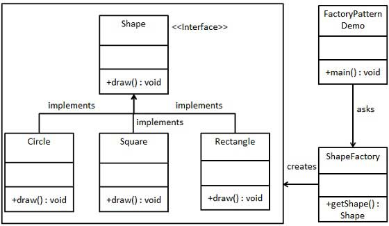
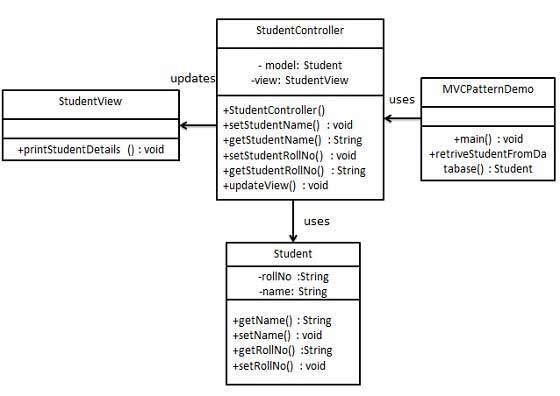

<link href="style.css" rel="stylesheet"></link>

# Design pattern
## Factory
* Créer des objets sans exposer la logique de création au client
* Utile si on ne sait pas la nature de l'objet à créer au lancement de l'execution du programe.
* Permet le découplage du client par rapport aux classes concrètes à instancier (meilleurs maintenance du code, ajout 
plus facile)
* Les objets créer utilisent une interface commune.
* Souvent utilisé dans les frameworks



## Singleton
* Permet de s'assurer qu'une seule instance de l'objet est présente dans le programme

```java
package singleton;

public class Singleton {
    private int nombre;

    private static Singleton instance = new Singleton();

    private Singleton() {}

    public static Singleton getInstance() {
        return instance;
    }

    public int getNombre() {
        return nombre;
    }

    public void setNombre(int nombre) {
        this.nombre = nombre;
    }
}
```

## MVC
* **Modèle :** le model represente un objet qui contient la partie data. Il peut aussi mettre à jour le controlleur si
ses données changent
* **Vue :** la vue représente la visualisation des données que le modèle contiens
* **Controlleur :** Le contrôleur agit à la fois sur le modèle et sur la vue. Il contrôle le flux de données dans l'objet 
modèle et met à jour la vue lorsque les données changent. Il garde la vue et le modèle séparés.



De façon générale on commence par instancier le **modèle** et la **vue**, puis on instancie le **controlleur** en lui 
passant ces derniers en paramètre.